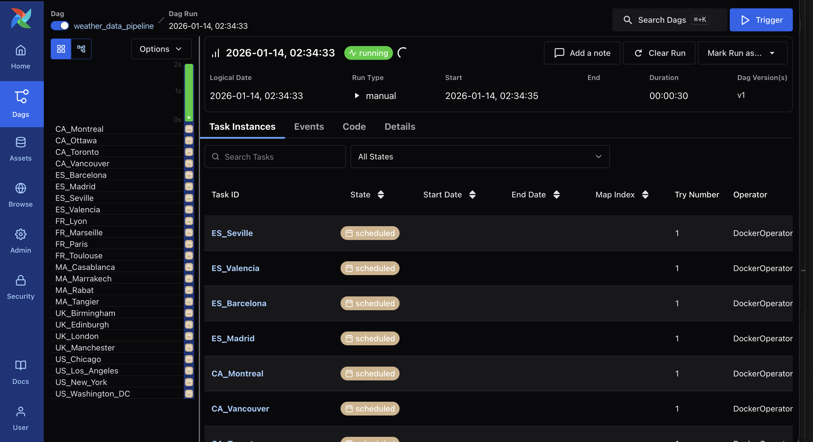

# Rain Analytics 
This project is a data analytics pipeline for rainfall and weather monitoring. It collects, processes, and transforms weather data from APIs and public datasets to provide insights on rainfall patterns, extreme weather events, and trends over time. The goal is to enable data-driven decisions for environmental analysis, agriculture planning, and urban water management 

## ETL Architecture Diagram


## DAG Workflow
The weather data pipeline DAG fetches weather data for 24 cities across 6 countries (US, FR, MA, UK, CA, ES). It runs daily at 2 AM with a maximum of 3 parallel tasks to respect API rate limits (3 req/sec, 25 req/hour, 500 req/day).



# High-Level Architecture
## 1️⃣ Data Sources

* **OpenWeather API** – Current, historical, and forecast rainfall data
* **Meteostat / NOAA** – Historical CSV datasets (optional backups for testing)
* **IoT Sensors** – Local rainfall measurements (optional)

## 2️⃣ Raw Layer (Landing Zone)

* **Purpose**: Store unmodified raw data for traceability and reproducibility
* **Format**: JSON/CSV from APIs and historical datasets
* **Storage**:
    * **AWS S3** – Production (recommended)
    * **Local Storage** – Development and testing

## 3️⃣ ETL / Ingestion Service

**Java ETL Service** (`etl-service/`)

**Responsibilities**:
* Fetch weather data from OpenWeather API
* Apply minimal transformations (timestamps, unit conversions)
* Upload raw data to AWS S3

**Key Components**:
* `WeatherApiClient.java` – API data fetching
* `DataTransformer.java` – Basic transformations
* `S3Uploader.java` – S3 data upload
* `Config.java` – Environment configuration

## 4️⃣ Orchestration Layer

**Apache Airflow** (`airflow/`)

**DAG**: `weather_data_pipeline`
* **Schedule**: Daily at 2:00 AM
* **Tasks**: 24 parallel tasks (one per city)
* **Rate Limiting**: Max 3 concurrent tasks (respects API limits: 3 req/sec, 25 req/hour, 500 req/day)
* **Pool**: `weather_api_pool` for resource management

**Workflow**:
1. Trigger Java ETL service via Docker containers
2. Fetch weather data for all configured cities
3. Upload raw data to S3
4. Trigger DBT transformations (planned)
5. Run data quality checks (planned)

## 5️⃣ Transformation Layer

**DBT** (`dbt-transform/`) - Medallion Architecture

| Layer | Description | Materialization |
|-------|-------------|----------------|
| **Bronze** | Raw API data as-is | Staging tables |
| **Silver** | Cleaned, standardized, and validated | Views/Tables |
| **Gold** | Aggregated metrics and analytics-ready datasets | Tables |

## 6️⃣ Serving Layer / Visualization

**BI Tools**: PowerBI, Tableau, Metabase

**Dashboards**:
* City-level rainfall heatmaps
* Monthly/yearly rainfall trends
* Extreme weather events timeline
* Country-level comparisons

## 7️⃣ End-to-End Workflow

1. **Airflow** triggers `weather_data_pipeline` DAG (daily at 2 AM)
2. **Java ETL** service runs in Docker containers (24 tasks, max 3 parallel)
3. Each task fetches weather data for one city via OpenWeather API
4. Raw JSON data uploaded to **AWS S3**
5. **DBT** transformations execute (Bronze → Silver → Gold)
6. Data quality checks validate transformed data
7. **Gold tables** ready for BI tools and reporting

## Data Model Architecture 
``` lua
+----------------+       +----------------+       +----------------+
|    Country     | 1 ──< |      City      | 1 ──< |    RainData    |
+----------------+       +----------------+       +----------------+
| country_id (PK)|       | city_id (PK)   |       | rain_id (PK)   |
| country_name   |       | city_name      |       | city_id (FK)   |
| iso_code       |       | country_id (FK)|       | date           |
+----------------+       | latitude       |       | daily_rain_mm  |
                         | longitude      |       | source         |
                         | is_official    |       | created_at     |
                         +----------------+       +----------------+
                                                      \
                                                       \
                                                        > AggregatedMetrics
                                                          +----------------+
                                                          | metric_id (PK) |
                                                          | city_id (FK)   |
                                                          | date           |
                                                          | avg_daily_rain |
                                                          | country_avg_rain |
                                                          | created_at     |
                                                          +----------------+
```
## Project Structure 
```
rain-analytics/
│── README.md
│── docker-compose.yml        # Orchestrates ETL, Airflow, DBT
│── .env                      # API keys, credentials
│
├── etl-service/              # Java ETL
│   ├── pom.xml
│   ├── Dockerfile
│   └── src/main/java/com/example/weather/
│       ├── App.java
│       ├── config/Config.java
│       ├── model/WeatherData.java
│       ├── service/
│       │   ├── WeatherApiClient.java
│       │   ├── DataTransformer.java
│       │   └── S3Uploader.java
│       └── util/DateUtils.java
│   └── src/main/resources/cities.json
│
├── airflow/                  # Apache Airflow orchestration
│   ├── docker-compose.yaml
│   ├── config/
│   │   └── airflow.cfg
│   ├── dags/
│   │   ├── weather_data_pipeline.py
│   │   └── config/
│   │       └── countries.json   # 24 cities across 6 countries
│   ├── logs/
│   ├── plugins/
│   └── my-dags/
│
├── dbt-transform/            
│   ├── Dockerfile
│   ├── dbt_project.yml
│   ├── profiles.yml.template
│   ├── models/
│   │   ├── bronze/
│   │   ├── silver/
│   │   └── gold/
│   ├── macros/
│   └── tests/
│
├── data/                     # Optional CSV/JSON backups
│
└── .github/workflows/
    ├── ci.yaml                # Test, build ETL JAR, lint DBT
    └── cd.yaml                # Deploy containers

``` 
