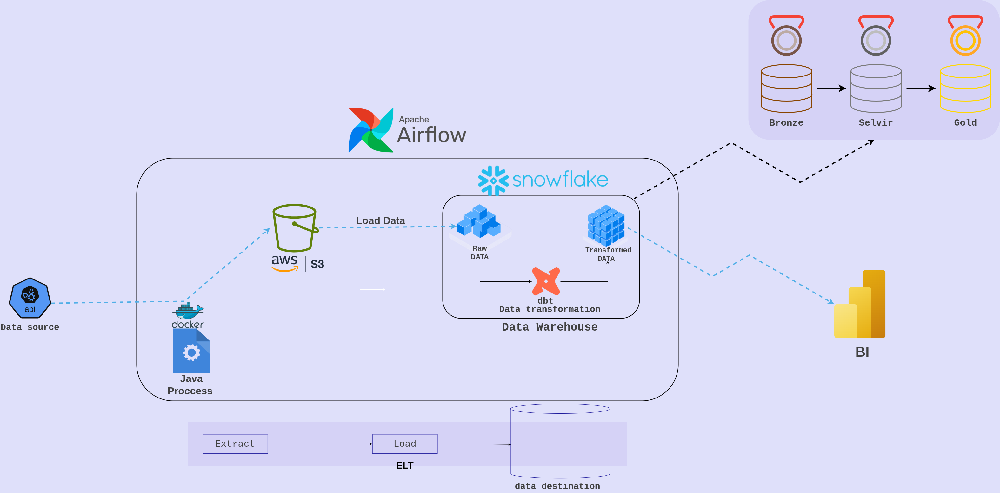

# Rain Analytics 
This project is a data analytics pipeline for rainfall and weather monitoring. It collects, processes, and transforms weather data from APIs and public datasets to provide insights on rainfall patterns, extreme weather events, and trends over time. The goal is to enable data-driven decisions for environmental analysis, agriculture planning, and urban water management 

## ETL Architecture Diagram


# High-Level Architecture
## 1️⃣ Data Sources

* penWeather API – current, historical, and forecast rainfall
* Meteostat / NOAA / Historical CSV datasets – optional backups for testing
* Optional IoT sensors – local rainfall measurements

## 2️⃣ Raw Layer (Landing Zone)

* Collect raw JSON/CSV data from APIs or historical datasets.
* Store unmodified data for traceability.
* Storage options:
    * AWS S3 (recommended for production)
    * Temporary Postgres/SQLite (for local testing)

## 3️⃣ ETL / Ingestion Service

* Java ETL service (etl-service/)
    * Fetch data from APIs
    * Transform minimal fields (e.g., timestamps, units)
    * Upload raw data to S3 / warehouse staging tables

* Key modules:

    * WeatherApiClient.java – fetch data
    * DataTransformer.java – basic transformations
    * S3Uploader.java – upload raw data
    * Config.java – environment variables & API keys

## 4️⃣ Orchestration Layer

* Apache Airflow (airflow/)
    * DAGs to run daily/weekly pipelines
    * Trigger Java ETL service → load to raw layer
    * Trigger DBT transformations
    * Run data quality checks
    * Send alerts / notifications

## 5️⃣ Transformation Layer (DBT) (dbt-transform/)

* Medallion Architecture:

| Layer | Description | Storage / Materialization |
|---|---|---|
Bronze | Raw API data | JSON / Snowflake staging tables
Silver | Cleaned & standardized | Snowflake views / tables
Gold | Aggregated metrics | Snowflake tables, ready for analysis

## 6️⃣ Serving Layer / Visualization

* BI tools: PowerBI, Tableau, Metabase
* Dashboards:
    * Heatmaps per city
    * Rainfall trends per month/year
    * Extreme events timeline

## 7️⃣ Workflow Summary

1. Airflow triggers extract_weather_dag
2. Java ETL service fetches data → uploads raw JSON to S3
3. Airflow triggers dbt_dag
4. DBT executes transformations (Bronze → Silver → Gold)
5. DBT / Great Expectations run data quality checks
6. Gold tables are ready for visualization or reporting

## data model architecture

## project structure 
```
rain-analytics/
│── README.md
│── docker-compose.yml        # Orchestrates ETL, Airflow, DBT
│── .env                      # API keys, credentials
│
├── etl-service/              # Java ETL
│   ├── pom.xml
│   ├── Dockerfile
│   └── src/main/java/com/example/weather/
│       ├── App.java
│       ├── config/Config.java
│       ├── model/WeatherData.java
│       ├── service/
│       │   ├── WeatherApiClient.java
│       │   ├── DataTransformer.java
│       │   └── S3Uploader.java
│       └── util/DateUtils.java
│   └── src/main/resources/cities.json
│
├── airflow/                  
│   ├── Dockerfile
│   ├── dags/
│   │   ├── all_project_dag.py
│   │   ├── extract_weather_dag.py
│   │   └── dbt_dag.py
│   └── requirements.txt
│
├── dbt-transform/            
│   ├── Dockerfile
│   ├── dbt_project.yml
│   ├── profiles.yml.template
│   ├── models/
│   │   ├── bronze/
│   │   ├── silver/
│   │   └── gold/
│   ├── macros/
│   └── tests/
│
├── data/                     # Optional CSV/JSON backups
│
└── .github/workflows/
    ├── ci.yaml                # Test, build ETL JAR, lint DBT
    └── cd.yaml                # Deploy containers

``` 
